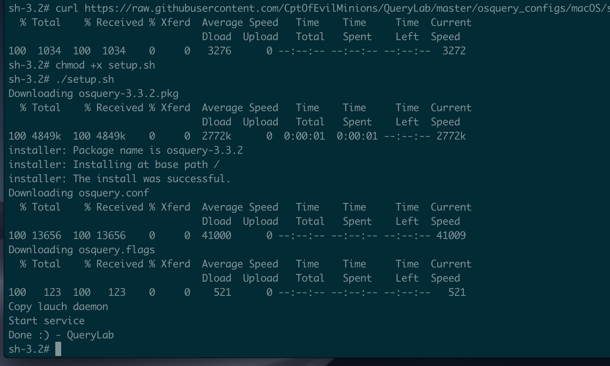

## <u>OSquery host configs</u>
* [OSquery config for Windows](https://github.com/CptOfEvilMinions/QueryLab/tree/master/osquery_configs/Windows)
* [OSquery config for Linux](https://github.com/CptOfEvilMinions/QueryLab/tree/master/osquery_configs/Linux)
* [OSquery config for macOS](https://github.com/CptOfEvilMinions/QueryLab/tree/master/osquery_configs/macOS)

## <u>Option 1 - Community</u>

### <u>Install/Setup OSquery on Windows</u>

### <u>Install/Setup OSquery on Linux</u>

### <u>Install/Setup OSquery on macOS</u>

## <u>Option 2 - Paranoid</u>

### <u>Install/Setup OSquery on Windows</u>
A [Powershell script](https://github.com/CptOfEvilMinions/QueryLab/blob/master/osquery_configs/Windows/setup.ps1) has been provided to download/install OSquery and then pull down [OSquery configs for Windows](https://github.com/CptOfEvilMinions/QueryLab/tree/master/osquery_configs/Windows). This script accepts several command line arugments such as: `osquery_version`, `osquery_flag_url`, `osquery_conf_url`.

1. `Open Powershell as Administrator`
1. `Invoke-Webrequest https://raw.githubusercontent.com/CptOfEvilMinions/QueryLab/master/osquery_configs/Windows/setup.ps1 -OutFile setup.ps1`
1. `.\setup.ps1`
    1. `Set-ExecutionPolicy Unrestricted`
    1. 

### <u>Install/Setup OSquery on Linux</u>
A [BASH script](https://github.com/CptOfEvilMinions/QueryLab/blob/master/osquery_configs/Linux/setup.sh) has been provided to download/install OSquery and then pull down [OSquery configs for Linux](https://github.com/CptOfEvilMinions/QueryLab/tree/master/osquery_configs/Linux). This script accepts several command line arugments such as: `osquery_version`, `osquery_flag_url`, `osquery_conf_url`.

1. `Open a terminal as Administrator`
1. `wget https://raw.githubusercontent.com/CptOfEvilMinions/QueryLab/master/osquery_configs/Linux/setup.sh`
1. `./setup.sh`
    1. 

#### <u>Supported OSes</u>
* Ubuntu Server 18.04 64-bit
* CentOS 7 64-bit

### <u>Install/Setup OSquery on macOS</u>
A [BASH script](https://github.com/CptOfEvilMinions/QueryLab/blob/master/osquery_configs/macOS/setup.sh) has been provided to download/install OSquery and then pull down [OSquery configs for macOS](https://github.com/CptOfEvilMinions/QueryLab/tree/master/osquery_configs/macOS).
1. `Open a terminal as Administrator`
1. `curl https://raw.githubusercontent.com/CptOfEvilMinions/QueryLab/master/osquery_configs/macOS/setup.sh --output setup.sh`
1. `chmod +x setup.sh`
1. `./setup.sh`
    1. 

#### <u>Supported OSes</u>
* macOS Mojave 10.14.3

## <u>Resources/Sources</u>

